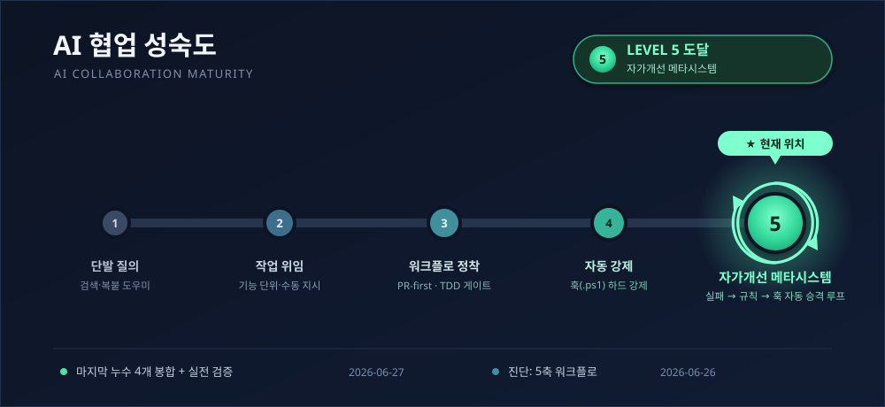

# BookTimer 📚⏱️

> 매일 일정 시간 책을 읽도록 독려하고 기록하는 **독서 타이머** 웹 애플리케이션
>
> 🌐 **Live**: https://booktimer.app

<p align="center">
  
</p>

---

## 1. 프로젝트 개요

BookTimer는 사용자가 하루에 일정 시간 책을 읽도록 **독려**하고 그 기록을 **누적**하는 서비스다.

단순한 스톱워치가 아니라, **읽지 않은 날의 부채가 7일 윈도우 안에서 누적되는** 타이머 메커니즘을 통해 "오늘 안 읽으면 내일 더 읽어야 한다"는 부담을 만들어 꾸준한 독서 습관을 유도한다.

**웹을 우선**으로 구현했고, 모바일은 **앱인토스(토스 미니앱) 채널로 출시**했다(2026-08-11). 웹이 본진, 미니앱은 조회·측정·가벼운 소셜 소비 중심.

**현재 상태**: 핵심 기능 구현·배포·운영 중. 누적 타이머 + 인증(아이디·소셜) + 책 단위 기록·책장 + 일자별 기록·잔디 + **독서 마을(수집형 식물·캐릭터·건물 게임화)** + 소셜(공개 프로필·검색·팔로우·차단·신고) + 제휴 구매 링크 + 운영자 대시보드까지 출하했다. HTTPS·Google 소셜 로그인·무중단 롤링 배포 운영 중. **앱인토스 미니앱**(4탭: 홈·서재·소셜·기록 + 리워드 광고 "밀린 하루 지우개")이 토스 앱 검색으로 서비스 중.

---

## 2. 핵심 기능

### 2.1 누적 증가 타이머 (핵심)

- 기본 기능은 **타이머**다.
- 매일 **하루 목표**만큼 읽어야 한다. (기본 1시간, **사용자 설정 가능**)
- 그날 채우지 못한 시간은 **7일 윈도우 부채**로 날짜별로 독립 집계된다.
- 단, 오래된 빚은 좌절·이탈하지 않도록 **7일 이상 지난 빚은 자동 용서**된다(최대 부채 7일치로 자연 제한).
- 오늘 할당량을 초과해 읽으면 그 초과분이 **가장 오래된 과거 빚부터 자동 상환**된다(backward-only catch-up).

#### 동작 예시 (하루 목표 = 1시간 가정)

| 일자 | 하루 목표 | 그날 소요 | 그날 부채 |
|---|---|---|---|
| 1일차 | 1시간 | 30분 읽음 | **30분** |
| 2일차 | 1시간 | 0분 | **1시간** |
| 3일차 | 1시간 | 2시간 읽음 | 0분 (오늘 1시간 달성 + 1시간 초과로 1·2일차 빚 상환) |

> 매일 목표만큼 부채가 발생하고, 읽은 만큼 그날 부채가 줄어든다. 초과분은 가장 오래된 빚부터 갚는다. 7일 이상 지난 빚은 자동으로 용서된다.

### 2.2 인증 / 식별 모델

식별·인증·표시 역할을 **세 값으로 분리**한다 (인스타·X의 @handle 모델).

| 값 | 역할 | 공개 | 가변 |
|---|---|---|---|
| **로그인 아이디 (`login_id`)** | 로그인 + 내부 식별 + **공개 @핸들**(검색·프로필 URL) | 공개 | **평생 1회 변경** |
| **닉네임 (nickname)** | 화면 표시 이름 | 공개 | 자유 변경 (중복 허용) |
| **이메일 (email)** | 연락·복구·OAuth 계정 연결 | **비공개** | (정책 별도) |

- **로그인은 아이디(login_id)로** 한다 — 공개된 이메일을 로그인 표적에서 분리한 보안 결정. 이메일로는 로그인할 수 없다.
- **Google 소셜 로그인**(OIDC) — `email_verified`만 신뢰하는 find-or-create 프로비저닝. 소셜 계정은 비밀번호가 없어 관련 UX를 분기.
- **온보딩** — 첫 진입 시 아이디(소셜 가입자)·표시 이름·타이머 초기값을 한 번에 설정.
- 계정 보안: 비밀번호 변경 / 회원 탈퇴, 로그인 무차별 대입 방어(IP 잠금).
- 설계: [claude-docs/login-id-design.md](claude-docs/login-id-design.md)

### 2.3 책 단위 기록 / 책장

- **책 등록** + 책별 누적 독서 시간 추적. **측정은 반드시 책을 지정**해야 한다(어떤 책을 얼마나 읽었는지 명확화).
- 외부 도서 검색(알라딘 API) 연동 — 제목으로 검색해 등록.
- **책장 상태**: 읽고싶음 / 읽는 중 / 완독. 책별 **공개 여부**(PUBLIC/PRIVATE) 설정.
- 책 상세·책장·공개 책방에서 **제휴(어필리에이트) 구매 링크** 제공(클릭 추적) — **알라딘 + 쿠팡 파트너스 병행**(쿠팡은 추적코드 설정 시 노출, 파트너별 클릭 분리 집계).

### 2.4 독서 기록 / 잔디

- 일자별 독서 시간 측정·저장, 누적 / 부채 추적.
- 그날 **읽은 책 제목**과 총 시간을 일자별로 표시.
- **잔디(기여 그래프)** — 날짜별 독서량을 시각화(하루 목표 대비 비율로 색 농도 결정). 공개 프로필에 노출.
- **연속 독서 성장 식물** — 연속 독서 일수에 따라 🟫땅→🌱새싹→🌷꽃→🌳나무로 성장.
- **수동 입력** — 빠뜨린 기록을 나중에 추가(최근 7일 윈도우 안, "빠뜨린 날 채우기" 링크). 수동 입력 날은 잔디에서 앰버 테두리로 구분.

### 2.5 독서 마을 (수집형 게임화)

잔디 기록을 기반으로 **식물·캐릭터·건물을 수집하고 나만의 마을을 꾸미는** 미니게임 레이어.
아이소메트릭(2.5D) 캔버스에 해금한 오브젝트를 자유롭게 배치하고 저장한다.

- **트랙 A — 타이머·독서 실적 연동 해금**:
  - **시간축** — 목표 달성일 누적 수로 식물 14종 순차 해금.
  - **장르축** — 특정 장르 1권 완독 시 해당 장르 식물 해금.
  - **작가·출판사 다양성** — 완독 distinct 작가/출판사 수 임계 달성 시 식물 해금.
  - **작가 캐릭터** — 특정 작가의 책을 완독하면 해당 작가 캐릭터(20종) 해금. 마을을 자유 배회하며 걷기 애니(bob·tilt·squash).
  - **출판사 건물** — 특정 출판사 책을 완독하면 해당 출판사 건물(10종) 해금.
- **트랙 B — 숨은 레시피** — 완독+읽고싶음 책의 조합으로 특정 식물을 발견(조합 힌트 없음, 발견 자체가 재미).
- **소품** — 보유 무관 장식(길·연못·울타리·벤치 등 13종)을 자유롭게 배치.
- **비주얼** — 코드 벡터 SVG(외부 에셋 0), 아이소메트릭 다이아몬드 격자, 식물 접지 그림자, 캐릭터 절차 걷기 애니메이션.
- `/village` (마을 편집·보기) / `/garden` (도감·수집현황) 접근.

### 2.6 소셜 (SNS)

- **공개 프로필** `/u/{login_id}` — 잔디·공개 책장 등.
- **사용자 검색** — 아이디(@핸들) 기준.
- **팔로우 / 언팔로우**, **차단(block)**, **신고(report)**(쓰기 남용 방지 rate limiting).
- **팔로우 범위 인기 카운트 + drill-down** — "그 책을 원함/읽음인 내 팔로우 명단"을 같은 게이트(팔로우·PUBLIC·distinct)로 펼침(새 노출 0, IDOR 없음).
- 공개범위·관계·IDOR·스키마 설계: [claude-docs/sns-design.md](claude-docs/sns-design.md)

### 2.7 운영자 대시보드

- `/admin` (ROLE_ADMIN 전용) — ENV 시드(`BOOKTIMER_ADMIN_LOGIN_IDS`)로 부트스트랩 승격.
- **운영 통계 요약** — 가입자 수·온보딩 완료·최근 7일 활성·총 책/세션·평균 독서 시간(읽기 전용 집계).
- **데이터 조회** — 사용자 목록(검색·페이징) + 드릴다운(타이머 설정·최근 세션·책장 요약). **PII 최소 노출**(비밀번호 해시 미전송, 이메일 마스킹).
- 운영자는 검색·공개 프로필에서 숨겨져 일반 사용자 동선과 분리.
- 설계: [claude-docs/admin-data-lookup-design.md](claude-docs/admin-data-lookup-design.md)

### 2.8 (설계 단계 — 미구현) 독서 성향 분석 · 구독

- **책장 기반 성향 분석("독서 MBTI")** — 사실 집계는 코드, 해석·서술만 LLM. 설계: [claude-docs/reading-personality-design.md](claude-docs/reading-personality-design.md)
- 성향·추천·채팅을 묶은 **월 정액 구독** 비즈니스 모델 구상(plan.md). **구현 전 설계 합의 필수.**

---

## 3. 기술 스택

| 영역 | 기술 | 비고 |
|---|---|---|
| **프론트엔드** | Thymeleaf (SSR) | 메인 UI. 마을(`/village`)은 Vue 3 SPA |
| **마을 프론트엔드** | Vue 3 + Vite + TypeScript | 마을 도감·게임 UI — SPA(`frontend/`) |
| **게임 엔진** | Phaser 3 | 마을 아이소메트릭 캔버스·캐릭터 배회·드래그 편집 |
| **토스 미니앱** | Vite + React 18 + TDS + `@apps-in-toss/web-framework` | 앱인토스 채널(`miniapp/`) — 서버 `/api/**`만 Bearer로 호출, 배포는 `ait` CLI(우리 CI 밖) |
| **백엔드** | Spring Boot 4.0.6 (Java 21) | 빌드 툴 Gradle (Groovy DSL) |
| **인증** | Spring Security | 아이디+비밀번호 자체 인증 + Google OAuth2/OIDC, 세션 외부화(JDBC) |
| **DB / 마이그레이션** | MySQL + JPA(Hibernate), **Flyway** | 운영 MySQL, 테스트는 H2 인메모리. 스키마는 Flyway가 단일 소스 |
| **클라우드** | AWS (ECS Fargate, ALB, RDS, ACM, Route 53) | Docker 컨테이너 배포, ALB TLS termination, 무중단 롤링 배포 |
| **CI/CD** | GitHub Actions | 빌드 / 테스트 / OIDC 키리스 배포 자동화 |

---

## 4. 로드맵

- [x] **MVP** — 누적 증가 타이머(사용자 설정 하루 목표) + 일자별 독서 시간 기록
- [x] AWS + Docker 배포 파이프라인 (GitHub Actions, OIDC 키리스)
- [x] HTTPS 적용 (도메인 + ALB TLS termination)
- [x] 세션 외부화(Spring Session JDBC) + 무중단 롤링 배포
- [x] OAuth 소셜 로그인 (Google)
- [x] **로그인 아이디(공개 @핸들) 도입** — 이메일을 로그인 식별자에서 분리
- [x] **책 단위 기록** — 책 등록(알라딘 검색) + 책별 누적 시간 + 책장 상태/공개여부
- [x] **잔디(기여 그래프)** + 일자별 읽은 책 표시 + 연속일 성장 식물
- [x] **소셜** — 공개 프로필·검색·팔로우·차단·신고·팔로우 범위 인기 drill-down
- [x] **제휴 구매 링크**(알라딘 + 쿠팡 파트너스 병행)
- [x] **운영자 대시보드** — 통계 요약 + 데이터 조회
- [x] **수동 독서 입력** — 빠뜨린 기록 사후 추가 (최근 7일 윈도우)
- [x] **7일 윈도우 부채 모델** — 날짜별 독립 부채, 오래된 빚 자동 용서, 초과 읽기로 과거 빚 상환
- [x] **작가 격언** — 대시보드 랜덤 격언 노출 (DB 관리·운영자 추가 가능)
- [x] **독서 마을** — 수집형 식물·작가 캐릭터·출판사 건물·숨은 레시피·아이소메트릭 캔버스 (Phaser 3 + Vue 3 SPA)
- [x] **랜딩 페이지 리디자인** — 와이드 마케팅 랜딩
- [x] **앱인토스 미니앱 출시** — 토스 앱 검색 채널, 4탭(홈·서재·소셜·기록) + 리워드 광고 "밀린 하루 지우개" (2026-08-11)
- [ ] 카카오/네이버 등 추가 provider (선택)
- [ ] 독서 성향 분석("독서 MBTI") + 구독 비즈니스 모델 (설계 완료, 구현 전 합의 필요)
- [ ] 네이티브 앱(모바일) 확장

---

## 5. 아키텍처

```
[ 사용자 브라우저 ]
        │  HTTPS
        ▼
[ AWS ALB ]  ── TLS termination (ACM 인증서), HTTP→HTTPS 리다이렉트
        │  HTTP (내부)
        ▼
[ ECS Fargate : Spring Boot ]
        │   ├─ Thymeleaf 뷰 (SSR) + Vue 3 SPA (마을)
        │   ├─ Spring Security (아이디/비밀번호 + Google OIDC)
        │   └─ Spring Session (세션을 RDS에 외부화 → 무상태 앱 서버)
        ▼
[ JPA / Hibernate ]   ── 스키마는 Flyway 마이그레이션이 단일 소스
        ▼
[ RDS (MySQL) ]

도메인/DNS: Route 53 (booktimer.app)
CI/CD: GitHub Actions → Docker 이미지 → ECS 롤링 배포 (start-then-stop, 자동 롤백)
```

> 인프라 상세(보안 그룹, IAM, 파라미터 등)는 `deploy/` 및 [claude-docs/deploy-aws.md](claude-docs/deploy-aws.md) 참고.

---

## 6. 핵심 도메인 규칙 요약

| 규칙 | 결정 |
|---|---|
| **하루 목표(daily increment)** | 매일 읽어야 하는 양. **사용자 설정**, 기본 1시간 |
| **하루 부채(per-day debt)** | `max(0, 하루목표 − 그날 읽은 초)` — 날짜별로 독립 발생, 저장 안 하고 완료 세션에서 유도 |
| **7일 윈도우(자동 용서)** | 최근 7일만 활성. 그 이전 부채는 **자동 용서**(좌절 방지). 최대 부채 7×목표로 자연 제한 |
| **backward-only catch-up** | 오늘 목표 초과 읽기 → 초과분이 **가장 오래된 과거 빚부터 자동 상환** (선납 불가) |
| **일일 리셋 시점** | **자정 00:00, 사용자 타임존 기준**. 이 시점에 새 하루 부채 발생 |
| **리셋 계산 방식** | **Lazy 계산** — 사용자 접속 시 `마지막 계산일 ~ 오늘`의 경과 일수만큼 per-day 부채 산출. 배치 스케줄러 없음 |
| **식별/인증 분리** | 로그인·식별·공개 핸들 = `login_id`(유니크 · 평생 1회 변경, 옛 핸들은 영구 예약), 표시 = nickname(가변·중복허용), 이메일 = 비공개 속성 |
| **측정엔 책 필수** | 측정 세션은 반드시 책을 지정(어떤 책을 읽었는지 명확). 레거시 null-book 세션은 읽기·집계만 보존 |
| **공개 경계** | 책 공개여부(PUBLIC/PRIVATE) + 차단 관계로 조회 주체를 게이트(IDOR 방지) |
| **타이머 신뢰성** | 부정 사용(켜두고 안 읽기) 검증 안 함. 자기 양심 기반 |

---

## 7. 부채 모델 계산 로직 (의사 코드)

사용자가 타이머 화면에 진입할 때마다 호출:

```
7일 윈도우 = [오늘-6 ~ 오늘] (사용자 타임존)

for 날짜 in 7일 윈도우:
    그날_목표 = GoalSchedule.goalFor(날짜)       // 그날 유효 목표(변경 이력 기반)
    그날_읽은_초 = 완료 세션 합계(날짜, 사용자TZ)
    하루_부채[날짜] = max(0, 그날_목표 − 그날_읽은_초)

// 오늘 초과분으로 backward-only catch-up (선납 불가)
초과분 = max(0, 오늘_읽은_초 − 오늘_목표)
for 날짜 in [어제 ~ 7일 전] (오래된 순):
    상환 = min(초과분, 하루_부채[날짜])
    하루_부채[날짜] -= 상환
    초과분 -= 상환

총_부채 = sum(하루_부채.values())
```

> 핵심: 날짜별 독립 부채, 7일 초과는 용서, 오늘 초과 읽기로 과거 빚을 갚는다. `GoalSchedule`로 목표 변경 전 날짜를 소급 오염 없이 판정(per-day 목표 스냅샷).

---

## 8. 빌드 / 실행

```bash
./gradlew build          # 빌드 (Windows: gradlew.bat)
./gradlew test           # 테스트 (H2 인메모리 + Vitest — Docker 불필요)
./gradlew bootRun        # 로컬 실행 (MySQL은 compose.yaml로 자동 기동, Docker 필요)
npm --prefix frontend run test:e2e   # E2E (Playwright; 별도 터미널에서 bootRun이 8080에 떠 있는 상태)
```

- toolchain: Java 21 (로컬에 없어도 foojay-resolver 가 자동 다운로드)
- 테스트는 H2 인메모리로 독립 실행되며, 운영은 MySQL을 사용한다. 스키마는 **Flyway** 마이그레이션이 단일 소스(`src/main/resources/db/migration`).
- 실행 시 Spring Security가 전 엔드포인트를 기본 잠금 — 가입/로그인 후 사용.
- **마을 프론트엔드 번들**(`src/main/resources/static/garden/garden.js`)은 커밋되어 있어 별도 빌드 불필요. 마을 TypeScript 소스(`frontend/`) 수정 시: `npm --prefix frontend run build`.
- **E2E(Playwright)**는 로컬 수동 — 별도 터미널에서 `bootRun`(시드계정 `testid`)을 띄운 뒤 `npm --prefix frontend run test:e2e`. 테스트는 `frontend/e2e/`(로그인·정원 저장). 커밋 게이트·CI엔 미포함(CI는 vitest·JUnit만).

---

## 9. 결정 보류 / 추후 확정 필요

- 아이디(login_id)·이메일 변경 정책(허용 여부·쿨다운)
- 독서 성향 분석의 분석 축·프라이버시·AI 모델, 구독 가격 가설 검증
- 추가 소셜 provider(카카오/네이버) 도입 여부

---

## 10. 관련 문서

- [DEVLOG.md](DEVLOG.md) — 개발 일지 (기능 추가 흐름 / 만난 문제 / 해결)
- [plan.md](plan.md) — 추후 할 일 / 로드맵 / 기술 부채 / 갱신 이력
- [claude-docs/code-map.md](claude-docs/code-map.md) — **기능별 코드 지도** (기능 작업 전 진입점·소속 파일 직행용 참조)
- [miniapp/README.md](miniapp/README.md) — 토스 미니앱(앱인토스) 프론트 — 화면 구성·개발·`ait` 배포 절차
- [claude-docs/domain-design.md](claude-docs/domain-design.md) — 도메인 모델 설계
- [claude-docs/login-id-design.md](claude-docs/login-id-design.md) — 로그인 아이디(식별/인증 분리) 설계
- [claude-docs/sns-design.md](claude-docs/sns-design.md) — 소셜(공개범위·관계·IDOR·스키마) 설계
- [claude-docs/admin-data-lookup-design.md](claude-docs/admin-data-lookup-design.md) — 운영자 데이터 조회 설계
- [claude-docs/reading-personality-design.md](claude-docs/reading-personality-design.md) — 독서 성향 분석(미구현) 설계
- [claude-docs/deploy-aws.md](claude-docs/deploy-aws.md) — AWS 배포 가이드
- [claude-docs/learning-notes.md](claude-docs/learning-notes.md) — 작업 중 배운 개념 정리
- [claude-docs/troubleshooting.md](claude-docs/troubleshooting.md) — 함정·해결 기록
- [claude-docs/copyright-registration.md](claude-docs/copyright-registration.md) — 한국 저작권 등록 가이드
